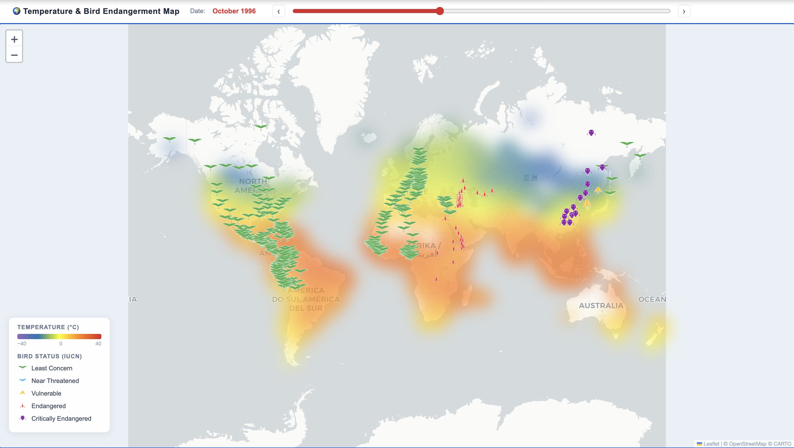
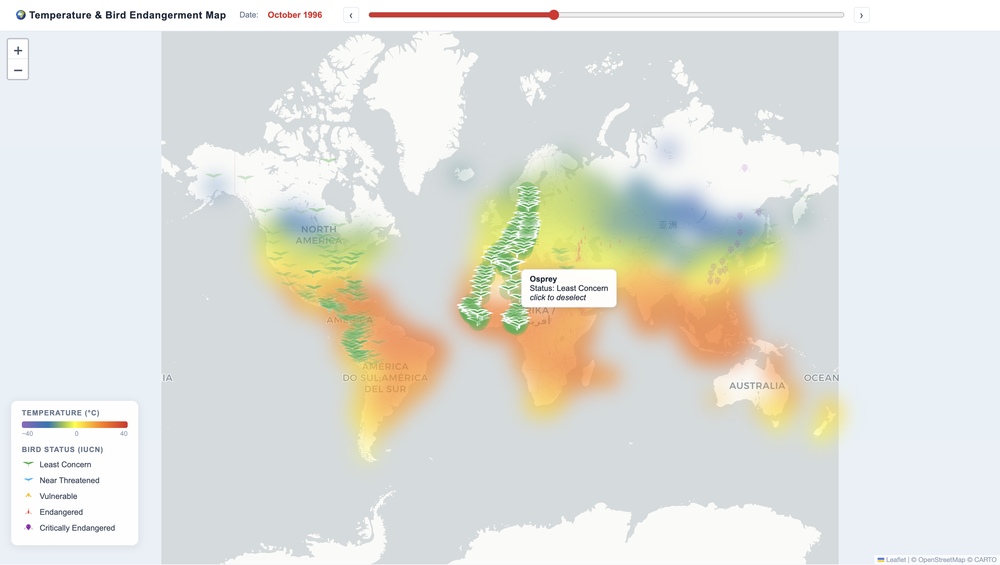

# Bird and Temperature Visualization

An interactive map visualization showing global bird endangerment and temperature over the years.

## Overview

Uses **D3.js** and **Leaflet** to visualize bird endangerment data alongside global temperature information.

## Data Files

Place the following CSV files in the `data/` folder:
- `bird.csv` - Bird migration data
- `temperature.csv` - Global temperature data

*Note: Data files are not included in the repository.*

## Usage

Open `index.html` in a web browser to explore the interactive map.

## Preview

The map combines two interactive layers:

- **Temperature heatmap**: a color-coded overlay showing average monthly surface temperatures worldwide, ranging from purple (−40°C) through blue, yellow, orange, to red (40°C).
- **Bird markers**: IUCN-classified species plotted at their recorded migration locations, each with a distinct icon shape and color by conservation status (green → yellow → orange-red → purple → blue, least concern to critically endangered).

## Interactions

- **Time slider**: scrub through months and years to see how temperatures and bird distributions shift over time. Use the `‹` `›` arrows for precise month-by-month stepping.
- **Hover**: mouse over any bird marker to see its species name and IUCN status.
- **Click to highlight**: click a marker to highlight all recorded locations of that species across the map; all other species fade out. Click again or click the map background to deselect.

